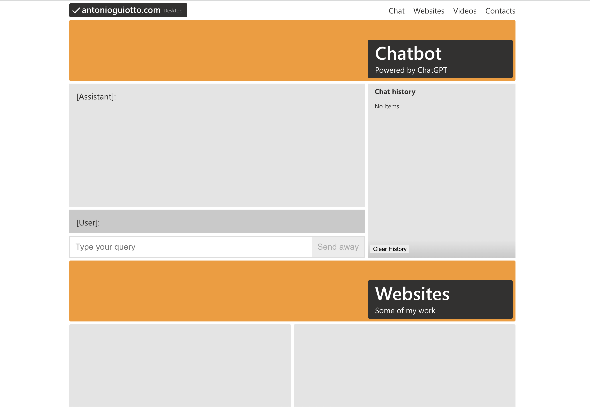

# Old Website

🔴 Offline

Open terminal, find a good directory where to store this website locally, then run:

```
git clone git@github.com:palloncino/antonioguiotto.com.git && cd ./antonioguiotto.com && npm i && npm start
```



> React, Typescript


